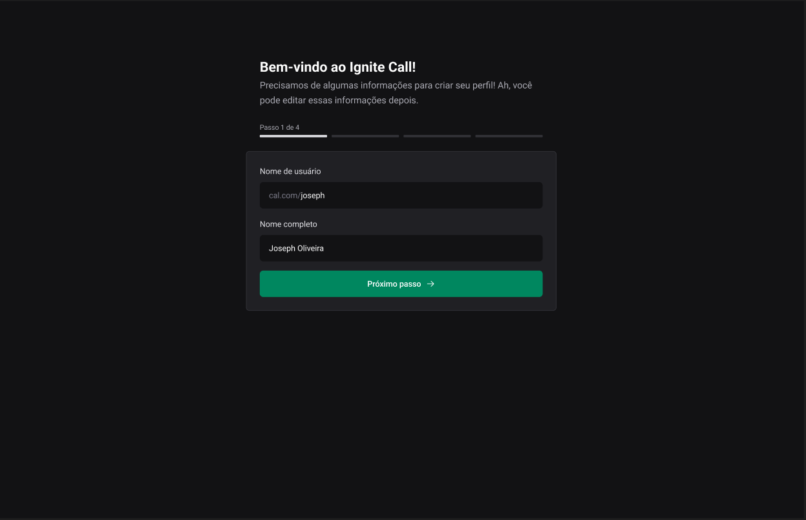
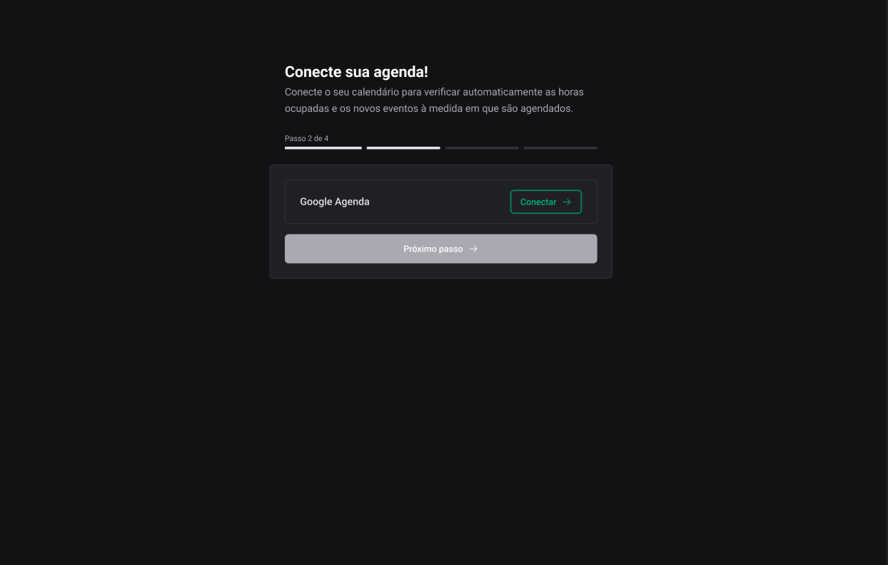
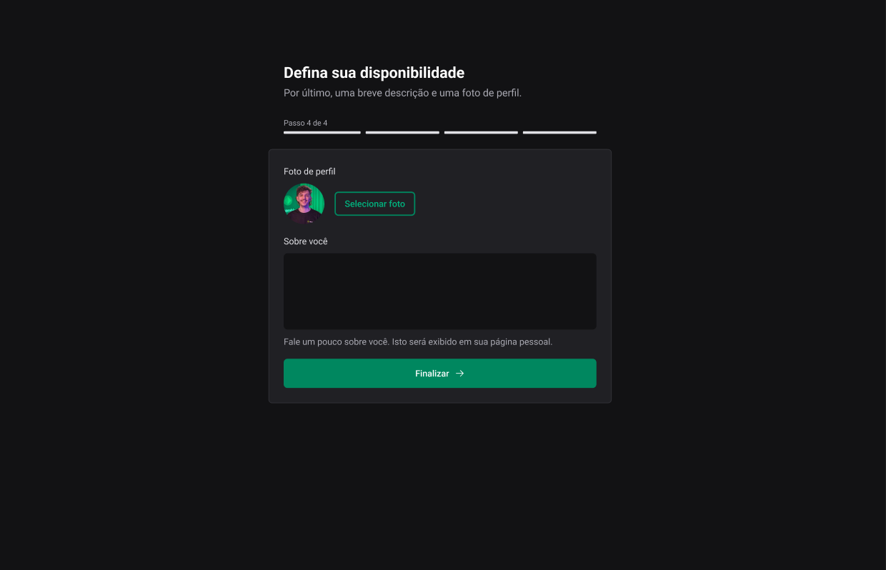
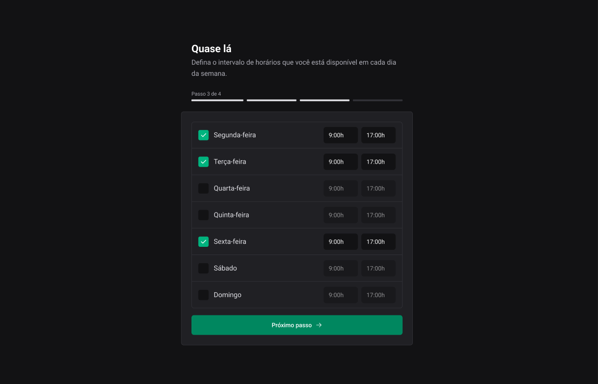
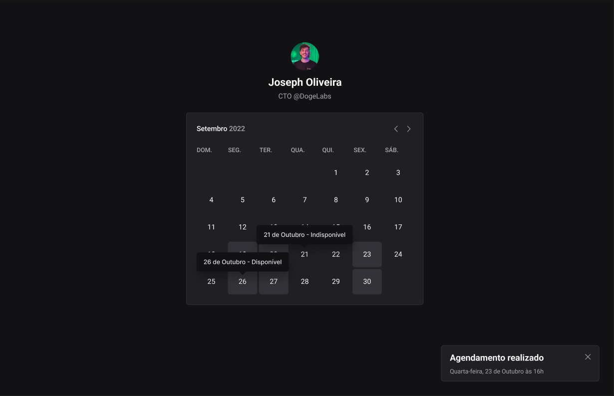
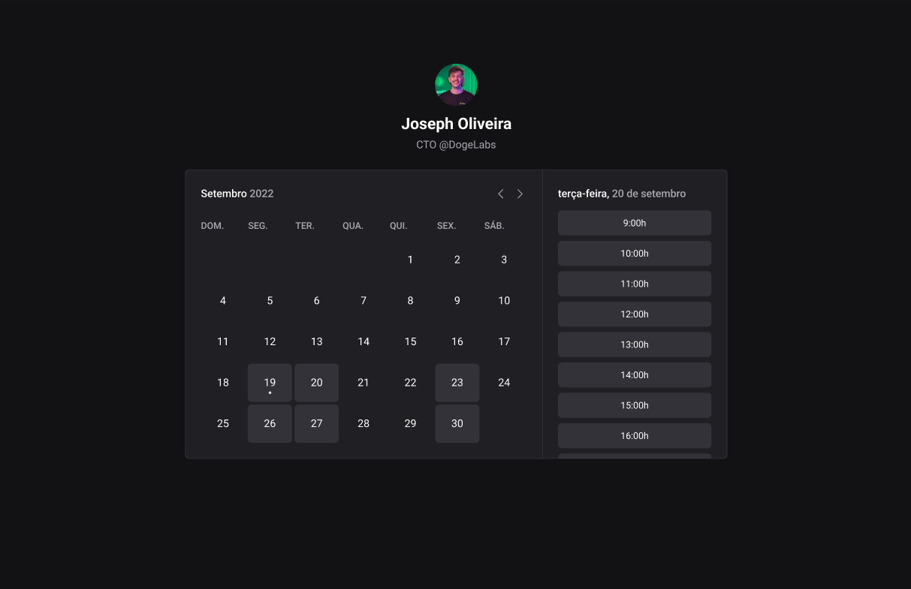
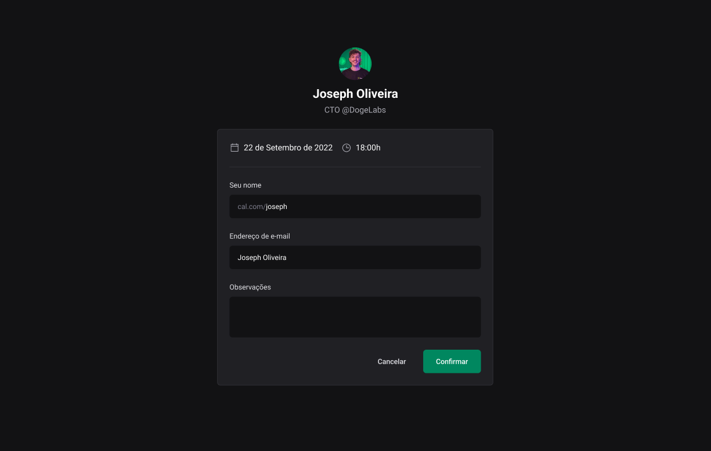

<p>
  
</p>

<h1 align="center">
  
</h1>

<h4 align="center"> 
	🚀 Aplicação finalizada 🚀
</h4>

<p align="center">
 <a href="#-about">About</a> |
 <a href="#-deploy">Deploy</a> |
 <a href="#-layout">Layout</a> | 
 <a href="#-how-it-works">How It Works</a> | 
 <a href="#-technologies">Technologies</a> | 
 <a href="#-author">Author</a> | 
 <a href="#-license">License</a>
</p>

## 💻 About

O projeto **Ignite Call** é uma aplicação de agendamentos que permite aos usuários compartilhar seu calendário e permitir que outros reservem horários disponíveis. A aplicação também se integra ao `Google Calendar` para visualização de agendamentos em diferentes plataformas. Desenvolvemos este projeto utilizando um `Design System` personalizado, o framework `Next.js` para o front-end e o ORM `Prisma` para interações com o banco de dados, incluindo validações e muito mais.

Vale ressaltar que este projeto foi desenvolvido como conclusão de um desafio proposto no curso/trilha **Ignite** oferecido pela [Rocketseat](https://www.rocketseat.com.br/).


### Registration

<p align="center">
  
</p>

### Connecting

<p align="center">
  
</p>

### Disponibility

<p align="center">
  
</p>

### Schedule

<p align="center">
  
</p>

### Date

<p align="center">
  
</p>

### Date/hours

<p align="center">
  
</p>

### Confirmation

<p align="center">
  
</p>
## 🚀 How it works

### Pré-requisitos

Antes de baixar o projeto você vai precisar ter instalado na sua máquina as seguintes ferramentas:

* [Git](https://git-scm.com)
* [NodeJS](https://nodejs.org/en/)
* [Yarn](https://yarnpkg.com/) ou [NPM](https://www.npmjs.com/)
* Para o banco de dados ter o [MySQL](https://www.mysql.com/) ou [Docker](https://www.docker.com/) para baixar a imagem do banco.

Além disto é bom ter um editor para trabalhar com o código como [VSCode](https://code.visualstudio.com/)

### Clonando e Executando

Passo a passo para clonar e executar a aplicação na sua máquina:

```bash
# Clone este repositório
$ git clone git@github.com:pabloxt14/ignite-call.git

# Acesse a pasta do projeto no terminal
$ cd ignite-call

# Instale as dependências
$ npm install

# Crie uma arquivo .env e preencha conforme apresentado no arquivo .env.example

# Executar seu banco de dados

# Executar o seguinte comando para criar as migrations no banco
$ npx prisma migrate dev

# Execute a aplicação em modo de desenvolvimento
$ npm run dev

# A aplicação inciará em alguma porta disponível que poderá ser acessada pelo navegador
```

---

## 🛠 Technologies

As seguintes principais ferramentas foram usadas na construção do projeto:

- **[typeScript](https://www.typescriptlang.org/)**
- **[next.js](https://nextjs.org/)**
- **[@ignite-ui/react](https://www.npmjs.com/package/@ignite-ui/react)**
- **[prisma](https://www.prisma.io/)**
- **[react-hook-form](https://react-hook-form.com/)**
- **[zod](https://zod.dev/)**
- **[@hookform/resolvers](https://www.npmjs.com/package/@hookform/resolvers)**
- **[phosphor-icons](https://phosphoricons.com/)**
- **[@tanstack/react-query](https://tanstack.com/query/latest)**
- **[axios](https://axios-http.com/ptbr/docs/intro)**
- **[cookies-next](https://www.npmjs.com/package/cookies-next)**
- **[next-auth](https://next-auth.js.org/)**
- **[next-seo](https://github.com/garmeeh/next-seo)**
- **[dayjs](https://day.js.org/)**


### Instrutor: CTO da [Rocketseat](https://rocketseat.com.br/) :rocket: Diego Fernandes
<td align="center"><a href="https://rocketseat.com.br"><br /><sub><b>Diego Fernandes</b></sub>
</a><br /><a href="https://rocketseat.com.br/" title="Rocketseat"></a></td>

## 🦸 Autor

[](https://www.linkedin.com/in/jason-everton/)

[](mailto:jasonemsw10@gmail.com)

Feito por Jason Everton 👋🏽 [Entre em contato!](https://www.linkedin.com/in/jason-everton)


